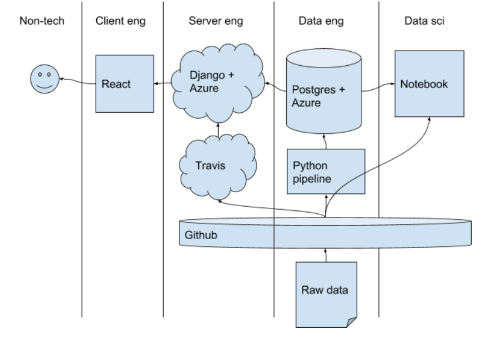

# datasci-campaign-finance

This project is a part of the [Data Science Working Group](http://datascience.codeforsanfrancisco.org) at [Code for San Francisco](http://www.codeforsanfrancisco.org).  Other DSWG projects can be found at the [main GitHub repo](https://github.com/sfbrigade/data-science-wg).

#### -- Project Status: [In Progress!]

## Project Intro/Objective
Campaign finance in the U.S is the key to the system of corruption that has now wrecked our government. Members and candidates for Congress spend anywhere between 30% to 70% of their time raising money to get themselves (re)elected. But who and how many people actually contribute to these campaigns?

It turns out that only a tiny fraction of the 1% are actually "relevant funders" of congressional campaigns. In other words, 150,000 Americans wield enormous power over this government. Furthermore, our government is supposed to represent the public, but with so few making meaningful financial contributions, how do we know if our elected officials are not answering to special demands these "funders" make?

This challenge and the problems we face is described in Lawrence Lessig's [TED Talk](https://www.ted.com/talks/lawrence_lessig_we_the_people_and_the_republic_we_must_reclaim) in which he discusses the problems of Campaign Finance in America as the number one issue that blocks progress on every other issue.

The goals of this project are to use data and technology to (1) provide more transparency of campaign finance within San Francisco and (2) investigate how campaign finance contributions affect elected officials' behavior. Our current Projects can be found [here](https://github.com/sfbrigade/datasci-campaign-finance/projects).

### Methods Used
* Inferential Statistics
* Machine Learning
* Data Visualization
* Predictive Modeling

### Technologies
* Python
* PostgreSQL
* Pandas, Jupyter
* Mode Analytics

### Overview

This project broadly decomposes into client/server and data eng/sci tasks:

[overview diagram source](https://docs.google.com/document/d/1NORbNeboouyEvdN3PTgUAhwUjrLw1bpv7rDJSMgYTMI/edit#heading=h.1c9u8wssp8nk).

We recently extracted the [client/server code into it's own repo](https://github.com/sfbrigade/congressional-data-django) (for cloning efficiency on Travis).

The data eng/sci code is housed in this repo.

## Needs of this project

- **Project Leads** (from Code for San Francisco): We need project leads that are willing to be a point of contact for the CSUMB students and be an engaging partner in scoping out the problem. We are also considering a "Support Rotation", see proposed schedule below which would consist of a team of project leads from C4SF who will rotate each week on being the mentor.

Other Roles Include:
- frontend developers
- data exploration/descriptive statistics
- data processing/cleaning
- statistical modeling
- writeup/reporting

## Getting Started

Please go to the [Onboarding](./onboarding) docs to start contributing to this project!

## Project History

| Time        | Milestone |
|------------ |------|
| December 2017 | <ul><li>Project Formulation Problem Statements Created</li><li>Ongoing Team Recruitment</li></ul> |
| January 2018 | <ul><li>Two Student Teams from California State University Monterey Bay Join (9 Total Students)</li><li>Problem Statement Refinement</li><li>Set up Postgres DB on Microsoft Azure </li> </ul> |
| February 2018 | <ul><li>Project Pitch at Code for San Francisco Demo Night</li><li>Mock Dashboards Up on Mode Analytics</li><li>First Strawman Machine Learning Model Predicting Election Results using Campaign Finance Data produced </li><li>Begin Working on Web App</li> </ul> |
| March 2018 | <ul><li>Pitched Project at Open Data Day SF</li><li>Improvements in Underlying Data Model</li><li>Begin working on deployment of Web App </li> </ul> |
| May 2018 | <ul><li>Student Teams Graduate!</li><li>Student Teams Present at Senior Thesis</li> </ul> |
| September 2018 | <ul><li>Talked with SF Ethic Commission</li><li>Pivoted Project to Visualization</li> </ul> |
| March 2019 | <ul><li>Pitched Project at Open Data Day 2019!</li> </ul> |

## Contact
* If you haven't joined the SF Brigade Slack, [you can do that here](http://c4sf.me/slack).  
* Our slack channel is `#datasci-campaignfin`
* Feel free to contact team leads with any questions or if you are interested in contributing!

## Appendix
Note while the main focus of this project will be on campaign finance, there are undoubtedly other very interesting questions using congressional data. Some additional ideas include:

1. Voting patterns - How has your Congressional representative voted over time? Do any factors correlate with a yes vote? Can we predict how she’ll vote on the next bill? How confident are we in the prediction? Can we establish a voting preference profile, e.g. trained on voter recommendations, and generate an alert when a prediction conflicts with our preference?
2. Visualizing Gerrymandering - (i.e. can we show evidence of racial gerrymandering, or other illegal/unethical gerrymandering by socio-demographic splits)
