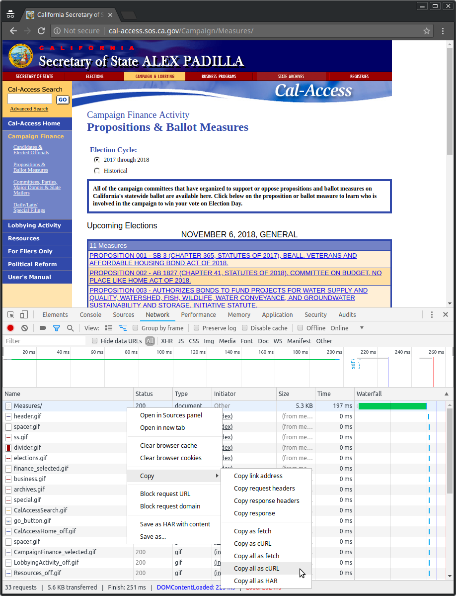

# Scrape
* Make python2 virtual environment, ie virtualenv, anaconda, pyenv etc.
* Download wheel file from [releases](https://github.com/aaj-github/datasci-congressional-data/releases/download/v0.0.1/scrape-0.0.1-py2-none-any.whl) on github.
* pip install scrape-0.0.1-py2-none-any.whl
* go to [http://cal-access.sos.ca.gov/Campaign/Measures/](http://cal-access.sos.ca.gov/Campaign/Measures/)
* Get cookie via chrome developer tools and copy as curl 
The full curl command will look like this
```
curl 'http://cal-access.sos.ca.gov/Campaign/Measures/' -H 'Connection: keep-alive' -H 'Pragma: no-cache' -H 'Cache-Control: no-cache' -H 'Upgrade-Insecure-Requests: 1' -H 'User-Agent: Mozilla/5.0 (X11; Linux x86_64) AppleWebKit/537.36 (KHTML, like Gecko) Chrome/68.0.3440.84 Safari/537.36' -H 'Accept: text/html,application/xhtml+xml,application/xml;q=0.9,image/webp,image/apng,*/*;q=0.8' -H 'Accept-Encoding: gzip, deflate' -H 'Accept-Language: en-US,en;q=0.9' -H 'Cookie: visid_incap_845960=M+OVW+a7Rt64IPlxcRhk77PYdFsAAAAAQkIPAAAAAACAzzaGAUUMqVJZl3HQgUTSdEc8OnbTmEZ+; _ga=GA1.2.244051564.1534384313; visid_incap_992756=Vi8NQFipQqeFVpZbksEctiDgdFsAAAAAQUIPAAAAAABpqtVeun83n+VBY4013cwr; visid_incap_955375=g7wQpDbkRs++RD64ORz9SGH7dFsAAAAAQUIPAAAAAADPkIIAbvHSaKvk9rIf0gvo; __utma=237255127.66904245.1534009667.1534009667.1534624946.2; __utmc=237255127; __utmz=237255127.1534009667.1.1.utmcsr=(direct)|utmccn=(direct)|utmcmd=(none); incap_ses_84_845960=dJHAdsUcvQ65drJZB28qAfOMeFsAAAAAHb+9JKJFby9M6Qin69QZTQ==; incap_ses_982_992756=mUb/ZgUZ1QKx97L8LcSgDfOMeFsAAAAAegj6JG37uZJq/wo57KyyqQ==; _gid=GA1.2.1855198375.1534627060; _gat=1' --compressed
```
but we only want the quoted Cookie Header
```
$ python -m scrape 'Cookie: visid_incap_845960=M+OVW+a7Rt64IPlxcRhk77PYdFsAAAAAQkIPAAAAAACAzzaGAUUMqVJZl3HQgUTSdEc8OnbTmEZ+; _ga=GA1.2.244051564.1534384313; visid_incap_992756=Vi8NQFipQqeFVpZbksEctiDgdFsAAAAAQUIPAAAAAABpqtVeun83n+VBY4013cwr; visid_incap_955375=g7wQpDbkRs++RD64ORz9SGH7dFsAAAAAQUIPAAAAAADPkIIAbvHSaKvk9rIf0gvo; __utma=237255127.66904245.1534009667.1534009667.1534624946.2; __utmc=237255127; __utmz=237255127.1534009667.1.1.utmcsr=(direct)|utmccn=(direct)|utmcmd=(none); incap_ses_84_845960=dJHAdsUcvQ65drJZB28qAfOMeFsAAAAAHb+9JKJFby9M6Qin69QZTQ==; incap_ses_982_992756=mUb/ZgUZ1QKx97L8LcSgDfOMeFsAAAAAegj6JG37uZJq/wo57KyyqQ==; _gid=GA1.2.1855198375.1534627060; _gat=1'
INFO:root:Scrape version: 0.0.1, api_version: 0
DEBUG:root:scrape
DEBUG:urllib3.connectionpool:Starting new HTTP connection (1): cal-access.sos.ca.gov:80
DEBUG:urllib3.connectionpool:http://cal-access.sos.ca.gov:80 "GET /Campaign/Measures/ HTTP/1.1" 200 None
DEBUG:urllib3.connectionpool:http://cal-access.sos.ca.gov:80 "GET /Campaign/Measures/Detail.aspx?id=1400044&session=2017 HTTP/1.1" 200 None
DEBUG:urllib3.connectionpool:http://cal-access.sos.ca.gov:80 "GET /Campaign/Committees/DetailContributionsMadeExcel.aspx?id=1406518&session=2017 HTTP/1.1" 200 None
DEBUG:urllib3.connectionpool:http://cal-access.sos.ca.gov:80 "GET /Campaign/Committees/DetailLateExcel.aspx?id=1406518&session=2017&view=LATE2 HTTP/1.1" 200 None
DEBUG:urllib3.connectionpool:http://cal-access.sos.ca.gov:80 "GET /Campaign/Committees/DetailLateExcel.aspx?id=1406518&session=2017&view=LATE3 HTTP/1.1" 200 None
DEBUG:urllib3.connectionpool:http://cal-access.sos.ca.gov:80 "GET /Campaign/Committees/DetailExpendituresMadeExcel.aspx?id=1406518&session=2017 HTTP/1.1" 200 None
DEBUG:urllib3.connectionpool:http://cal-access.sos.ca.gov:80 "GET /Campaign/Committees/DetailContributionsReceivedExcel.aspx?id=1406518&session=2017 HTTP/1.1" 200 None
DEBUG:urllib3.connectionpool:http://cal-access.sos.ca.gov:80 "GET /Campaign/Committees/DetailLateExcel.aspx?id=1406518&session=2017&view=LATE1 HTTP/1.1" 200 None
```
